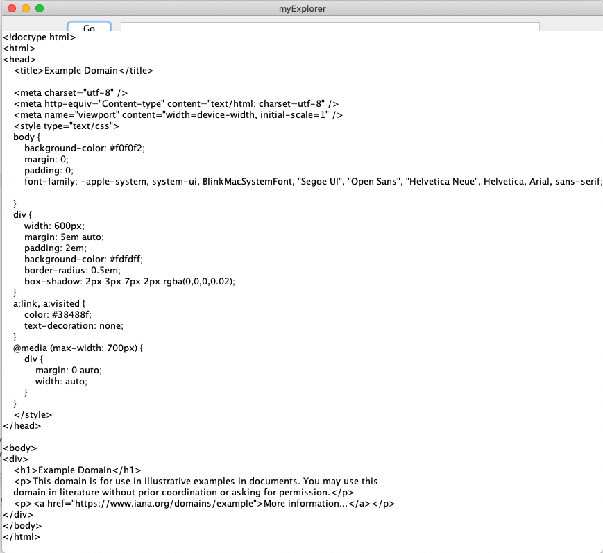

## DAT100: Java Programmering 10 - Uke 44

Java-koden som skal brukes i oppgavene nedenfor finnes på den vanlige github-oppbevaringsplassen for faget: https://github.com/dat100hib/dat100public

Gjør en *Repository -> Pull* i GitHub desktop på `dat100public`-oppvebaringsplassen slik du er sikker på at du har den nyeste versjon av koden.

Start med å importere JPLab10-prosjektet inn i Eclipse om du ikke allerede har gjort dette.

### Oppgave 1 - Filer og unntak

Koden nedenfor finnes i klassen `LeseFraFil.java`, pakken `no.hvl.dat100.oppgave1` i JPLab9 Eclipse-prosjektet

Main-metoden leser inn navn på fil og etterpå skrives hver linje i filen ut med et linjenummer foran.

```java
public class LeseFraFil {

  static String MAPPE_STR = System.getProperty("user.dir") + "/src/no/hvl/dat100/oppgave1/";

  static public void main(String[] args) throws FileNotFoundException {

  String filnavn;

  filnavn = JOptionPane.showInputDialog("Filnavn i mappen " + MAPPE_STR);

  File file = new File(MAPPE_STR + filnavn);
  Scanner reader = new Scanner(file);

  int linenumber = 1;

  // les innhold i filen linje for linje
  String line;

  while (reader.hasNextLine()) {
    line = reader.nextLine();
    System.out.println(linenumber + " " + line);
    linenumber++;
  }

  reader.close();

  // JOptionPane.showMessageDialog(null, "Filen " + filnavn + " finnes
  // ikke. \n" + e.getMessage());
  }
}
```

##### a)

Se på side 274 i Java boken og start med å kjøre programmet ovenfor ved eks. ved å angi `LeseFraFil.java` som filnavn.

##### b)

Unntaket `FileNotFoundException` kan kastes/signaleres om filen vi forsøker å åpne ikke finnes. Siden det er et sjekket-unntak (checked exception) må vi bruke en throws-klausul for å angi at koden potensielt kan signalere et slik unntak. Kjør programmet – hva skjer om filen ikke finnes? For å fremprovosere unntaket må du taste inn et filnavn som ikke finnes.

##### c)

Skriv koden ovenfor om slik der brukes en `try-catch` blokk til å forsøke å lese inn innholdet i filen og slik `FileNotFoundException` unntaket fanges opp med en `catch` og en feilmelding gis til brukeren. Kjør programmet – hva skjer nå om filen ikke finnes?

##### d)

Utvid programmet slik brukeren får et antall forsøk til å angi en fil som finnes. Når antall forsøk er oppbrukt skal programmet stoppe.

##### e)

Skriv om programmet slik det bruker klassen `BufferedReader`:

https://docs.oracle.com/en/java/javase/11/docs/api/java.base/java/io/BufferedReader.html

til å lese en innholdet av filen. Generelt sett er bruken av denne klassen mer effektiv ift. `Scanner` da den leser større mengder av data fra fil om gangen.

### Oppgave 2 - MyWebBrowser og unntakshåndtering

I pakken `no.hvl.dat100.oppgaveb2` finnes starten på en enkel nettleser. Du skal utvide
programmet slik det kan hente web-sider for nettet. Programmet startes ved å kjøre main-metoden
som finnes i klassen `StartBrowser.java`. Gjøres dette fås følgende skjermbilde:


Ideen er at brukeren kan taste inn en URL i linjen på toppen eks. http://www.example.com, trykke på Go-knappen og så skal programmet hente web-siden og visen HTML-koden som kommer tilbake, eks:



Programmet bruker Java-swing biblioteket til å implementere en brukergrensesnitt. Dette skal vi komme tilbake til mot slutten av faget.

Når brukeren trykker på Go-knappen kjøres metoden `actionPerformed` i klassen `GoBtnListener.java`. Denne metoden skal hente en web-side på nettet ved å bruke klassen URL (se side 292 i boken) og skrive den ut i det store vinduet. Det meste av koden i metoden er kommentert ut fordi den mangler håndtering av de to sjekkede unntak (checked exceptions) som kan bli signalert:

- `MalformedURLException` hvis brukeren ikke taster inn tekst som er en lovlig URL eks. strengen «kjhdfdjhfkjd»

- `IOException` hvis nett-siden ikke finnes, eks. http://denne.finnes.ikke

Gjør ferdig implementasjonen av metoden `actionPerformed` ved å legge inn unntakshåndtering slik koden kan kompilere. Bruk try-catch-finally. Det meste av det som trengs - bortsett fra unntakshåndtering - finnes som kommentarer i koden.

Der skal skrives en feilmelding ut i det store feltet `webpagetextarea` om URL’en ikke er lovlig eller hvis nettsiden ikke finnes. Feltet der URL’en skrives inn `urltextfield` skal altid settes til en tom streng når brukeren har trykket på Go. I begge tilfeller finnes en metode `setText` på de to objekter `webpagetextarea` og `urltextfield` som representerer textfelter. Denne kan brukes til å sette teksten.

### Oppgave 3 - Arrays og kjøretid for Java-programmer (valgfri)

Oppgaven fokuserer på bruk Java API dokumentasjon https://docs.oracle.com/en/java/javase/11/docs/api/index.html og måling av utføringstid for programmer.

Når der i API dokumentasjonen for Java plattformen står at en metode (eller klasse) er «deprecated» betyr at den er foreldet og at den dermed ikke skal brukes når vi lager ny kode. Grunnen til at foreldede metoder er fortsatt en del av mange Java pakker er for å sikre at koden som bruker en eldre versjon av API’en fortsatt kan kjøre uten at vi trenger å endre i koden.

De fleste programmene vi skriver i første semester vil utføres så raskt at det er vanskelig å måle utføringstiden av programmet.  På forelesningene har vi sagt at det finnes ferdige klasser i Java for å behandle tabeller. En slik klasse er `Arrays` (i pakken `java.util`): https://docs.oracle.com/en/java/javase/11/docs/api/java.base/java/util/Arrays.html

Her finnes det blant annet metoder for å sortere en tabell. Dersom vi sorterer en tabell med for eksempel 1000000 heltall, kan vi måle tiden ved hjelp av metoder i klassen `System` (i pakken java.lang):

https://docs.oracle.com/en/java/javase/11/docs/api/java.base/java/lang/System.html

eller klassene `Instant` og `Duration` (i pakken `java.time`):

https://docs.oracle.com/en/java/javase/11/docs/api/java.base/java/time/Instant.html

https://docs.oracle.com/en/java/javase/11/docs/api/java.base/java/time/Duration.html

##### a)

Vi skal sette av plass til en tabell med 1000000 elementer. Deretter fyller vi den med slumptall (tilfeldige tall). Det finnes flere måter å generere tilfeldige tall i Java. Den enkleste er kanskje metoden `random()` i klassen `Math`:

https://docs.oracle.com/en/java/javase/11/docs/api/java.base/java/lang/Math.html#random()

Denne metoden returnerer et flyttall større eller lik 0 og mindre enn 1.

Tabellen skal sorteres ved å bruke en passende metode fra klassen `Arrays`. Tiden for selve sorteringen skal måles og svaret skal skrives ut i millisekunder.

Det å lese API dokumentasjon for klassene `System` (eller `Instant` og `Duration`), `Math` og `Arrays` for å finne de rette metoder er en del av oppgaven.

##### b)

Varier antall av elementer i tabellen og undersøk hvordan utføringstiden påvirkes.